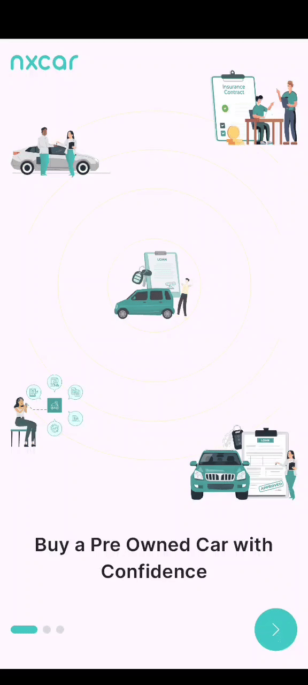
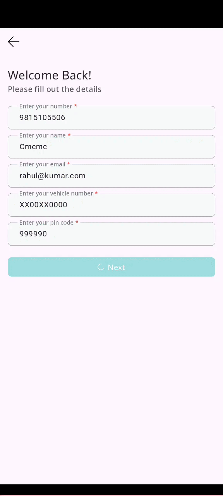

# NxCar Demo

NxCar Demo is a Flutter project showcasing various screens, components, **smooth animations** and **form validation** in a flutter application.
It includes features such as onboarding, login, OTP verification.

## ✨ Features

- Animated screen transitions using `AnimatedContainer`, `AnimatedOpacity`
- Form validation with real-time feedback
- Custom animated focus and input fields
- Clean widget structure
- Minimal and elegant UI

---

## 🎯 Project Context

This app was built as part of a Flutter animation-focused assignment during a hiring process.  
It demonstrates smooth animated transitions, form validation, and clean state handling using Bloc — all implemented without relying on external libraries.

The app itself was well-received and stands as a solid demonstration of my skills in Flutter UI/UX architecture and animation.

---

## 🛠 Tech Stack

This project uses:
- Flutter `3.27.2` and Dart `3.7.0`
- Pure Flutter animation widgets (`AnimatedContainer`, `AnimatedOpacity`, etc.)
- Bloc for managing the form state
- No third-party animation libraries — everything is done using Flutter’s core tools

---

## 📸 Screenshots

| Onboarding Screen                   | Form Validation | Otp Screen |
|-------------------------------------|-----------|------------|
|  |  |  |

---

## 🧠 Highlights

- Delivered a complete animated flow using only Flutter’s built-in animation APIs
- Managed form state and validation cleanly using Bloc
- Created a polished, responsive UI suitable for production-quality apps
- Confident in building custom animations without relying on third-party libraries

---

# 🧱 App Architecture & UI Components 

### Custom Components

- `AppAssetsName`: Contains asset names used in the app.
- `AppToolbar`: Toolbar component for navigation.
- `AppTextField`: Custom text field widget for input fields.
- `AppButton`: Custom button widget.

## Screens

### OnboardingScreen

The `OnboardingScreen` introduces users to the app's features and benefits through a series of
slides. Users can swipe through the slides and proceed to the next screen.

#### Components

- `OnboardingScreenCubit`: Manages the state and logic for the onboarding screen.
- `IconPositions`: Enum defining different positions for icons on the onboarding screen.

### LoginScreen

The `LoginScreen` allows users to log in to their account or create a new one. It includes input
fields for phone number, name, email, and vehicle number.

#### Components

- `LoginScreenCubit`: Manages the state and logic for the login screen.
- `VehicleNumberFormatter`: Formatter for vehicle number input field.

### OTPScreen

The `OTPScreen` is used for OTP verification. Users receive a one-time password on their phone
number and enter it to proceed.

#### Components

- `OTPScreenCubit`: Manages the state and logic for the OTP screen.

## 📱 Download & Try

Wanna give it a spin? Grab the APK and test it out yourself:

  
# 🙋‍♂️ About Me

Hey there! I’m **Rahul Rathore** — a mobile app developer with solid experience in **Native Android**, **Flutter**, and **Jetpack Compose**.

I build smooth UIs, obsess over clean architecture, and enjoy breathing life into apps with motion and interactivity. This project is one of many experiments I’ve built with love and caffeine ☕️.

### 🔗 Let’s Connect

### 🔗 Checkout my dev-blogs on
- 🧠 [Medium](https://rathorerahul586.medium.com/)

> 🚀 **Open to work!**  
> If you're looking for someone who can craft slick mobile apps and handle UI/UX like a pro, feel free to reach out.  
> Or just zoom into the screenshots... my contact details are sneakily hidden in there like an easter egg 🥚👀.

